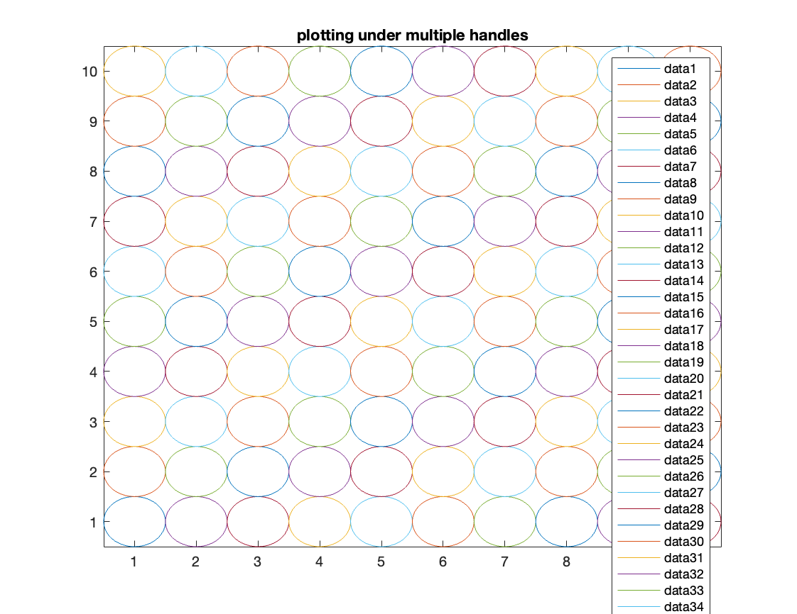
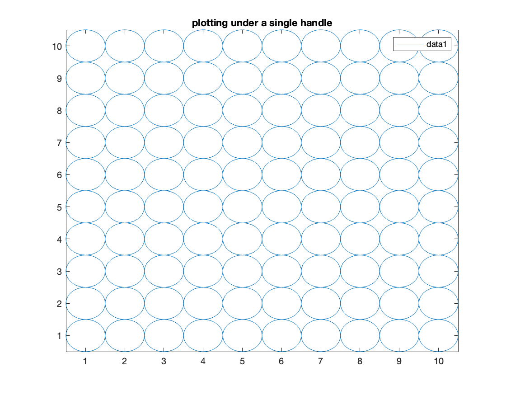
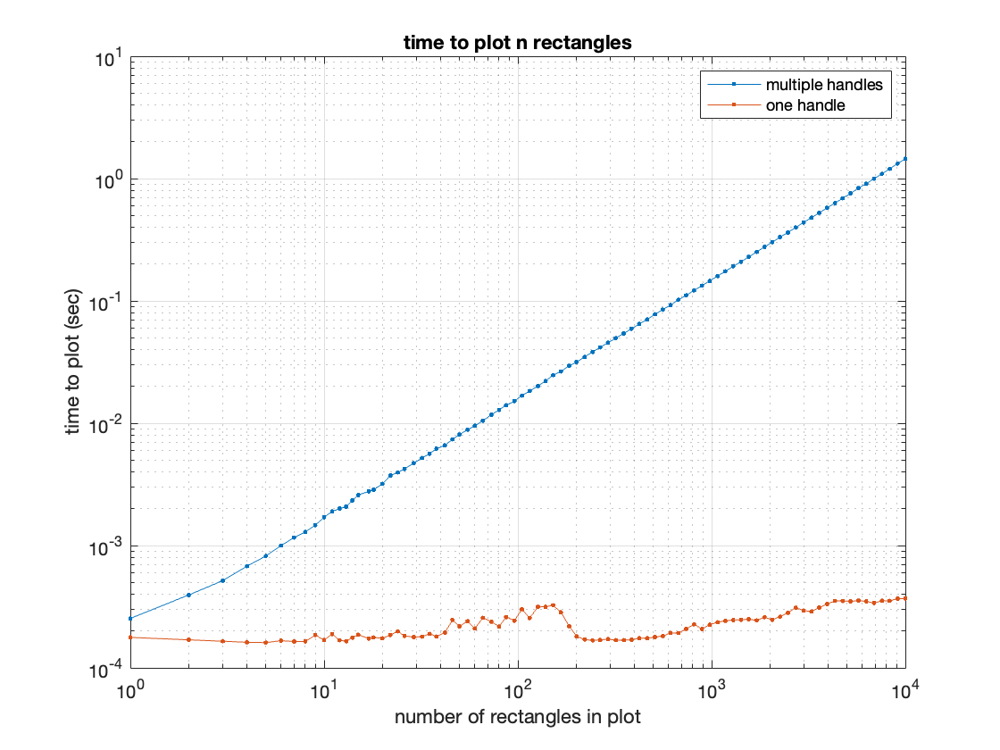

# fast primitive shapes (fps)

MATLAB plots get slow when bogged down with lots of objects drawn
into an axis.  One way to speed things up is to interleave `NaN`s with
your plotted data, which MATLAB interprets as a line break in the plot.
This allows you to plot multiple shapes under the same handle (i.e. the
same call to `line`, `plot`, `plot3`, etc) if you format your data to
take advantage of this trick.

This library provides functions that exploit this trick so that you don't
have to deal with reformatting your data to take advantage of this speedup.

## Examples

### fps.circle

First, we use `fps` functions to define the data to be plotted:

```
radius = 0.5;
[x, y] = meshgrid(1:10);
[xdata, ydata] = fps.circle(x(:), y(:), radius);
```

If these arrays are passed as-is to `plot` or `line`, it works similarly to plotting the shapes one-by-one in a loop, which is relatively slow but sometimes desirable:
```
plot(xdata, ydata)
```



But if we want to take advantage of the power of these functions we'll need to flush `xdata` and `ydata` to column vectors using the `colon` operator.  This will interleave `NaN`s between the shapes which will result in all of the shapes plotted under a single handle--much faster!

```
plot(xdata(:), ydata(:))
```


## Benchmark

Running the included script `test/fps_benchmark.m`, we can see why keeping the number of handles plotted to a minimum is important for performance.  Note I ran this with 15 trials and took the median, but the included script has `n_trials`=1.

