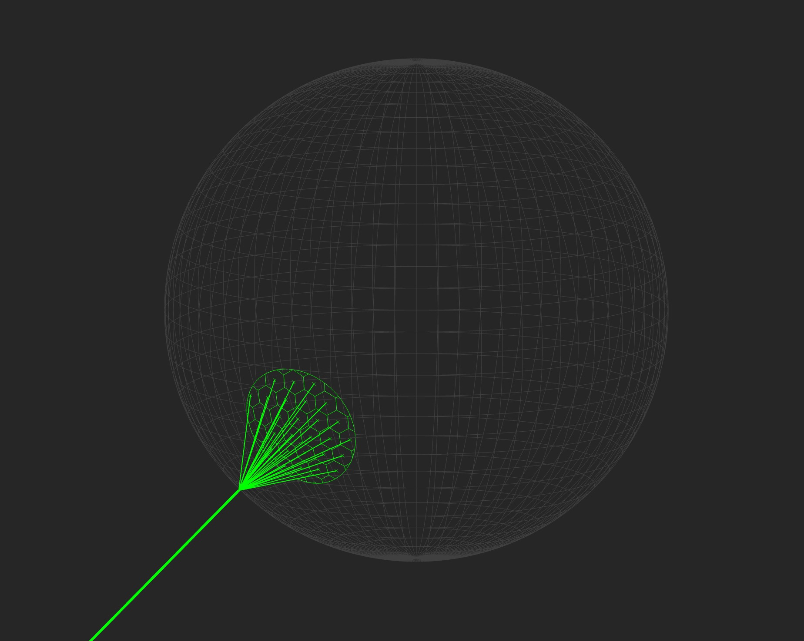

# fast primitive shapes (fps)

MATLAB plots get slow when bogged down with lots of objects drawn
into an axis.  One way to speed things up is to interleave `NaN`s with
your plotted data, which MATLAB interprets as a line break in the plot.
This allows you to plot multiple shapes under the same handle (i.e. the
same call to `line`, `plot`, `plot3`, etc) if you format your data to
take advantage of this trick.

This library provides functions that exploit this trick for a variety
of shape primitives, which allows you render some complex geometry while
maintaining good performance (i.e. using as few handles as possible).

## Examples

### Deathstar

Let's get right into an example of some more advanced usage!  The visualization below was generated with [fps_deathstar_example.m](./test/fps_deathstar_example.m).  This demo illustrates how you can combine functions in this library to visualize some complex geometry with a small number of handles (in the example it uses 4 line objects in total, and could be reduced to 3 with a little more effort).  All of the functions are highly-vectorized and designed to plot many separate shapes at once.




### The basics with fps.circle

First, use `fps` functions to define the data to be plotted:

```
radius = 0.5;
[x, y] = meshgrid(1:10);
[xdata, ydata] = fps.circle(x(:), y(:), radius);
```
Let's take a look at what we get: 

Our meshgrid of x & y points results in a 10x10 grid, or 100 points in total.  Calling [fps.circle](+fps/circle.m) on those arrays will therefore request the data required to plot 100 circles.  In `xdata` and `ydata`, that's why they both have 100 columns; each column encodes the data for a separate circle.  The rows index the datapoints that compose each circle.  They each have 102 elements because by default it uses N=100, with an extra vertex to close the shape and a `NaN` at the end as the line break.

If these arrays are passed as-is to `plot` or `line`, it works similarly to plotting the shapes one-by-one in a loop; i.e. MATLAB iterates over each column and plots them as a separate object.  This is effectively the same as calling `plot` in a loop, which is relatively slow both because of the repeated calls to `plot` and because it results in a separate line object added to the axis for each circle.  It looks like this:
```
% slow!
plot(xdata, ydata)
```


But, if we want to take advantage of the power of these functions, we'll need to reshape `xdata` and `ydata` to column vectors using the `colon` operator.  This will interleave `NaN`s between the shapes, which will result in all of the shapes plotted under a single handle--much faster!

```
% fast!
plot(xdata(:), ydata(:))
```


## Benchmark

Running the included script [fps_benchmark.m](./test/fps_benchmark.m), we can see why keeping the number of handles plotted to a minimum is important for performance.  Note I ran this with 15 trials and took the median, but the included script has `n_trials`=1.


