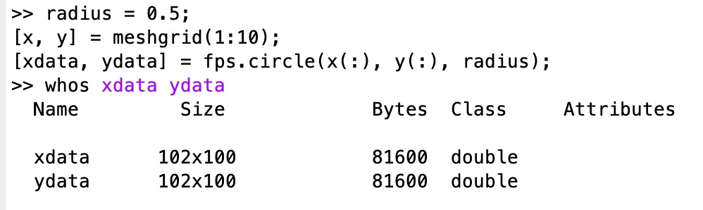
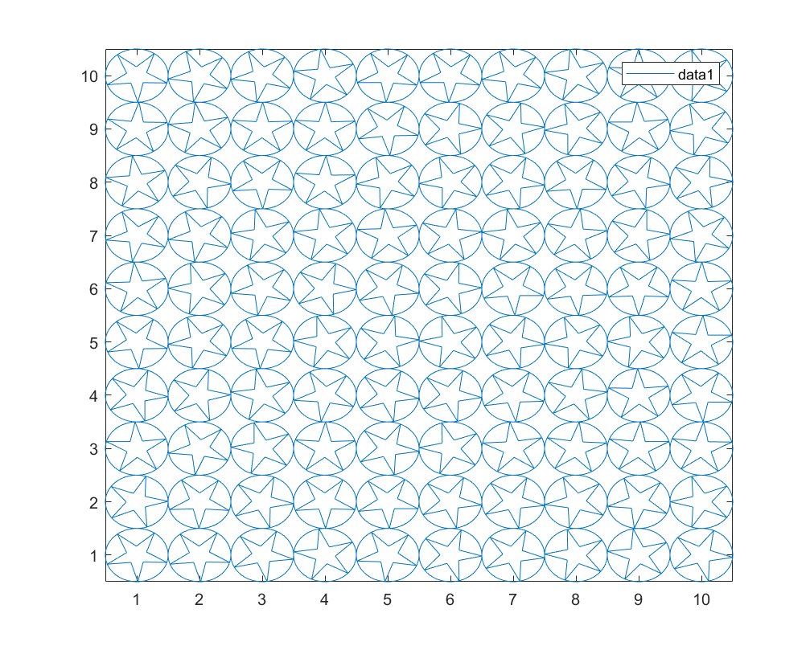
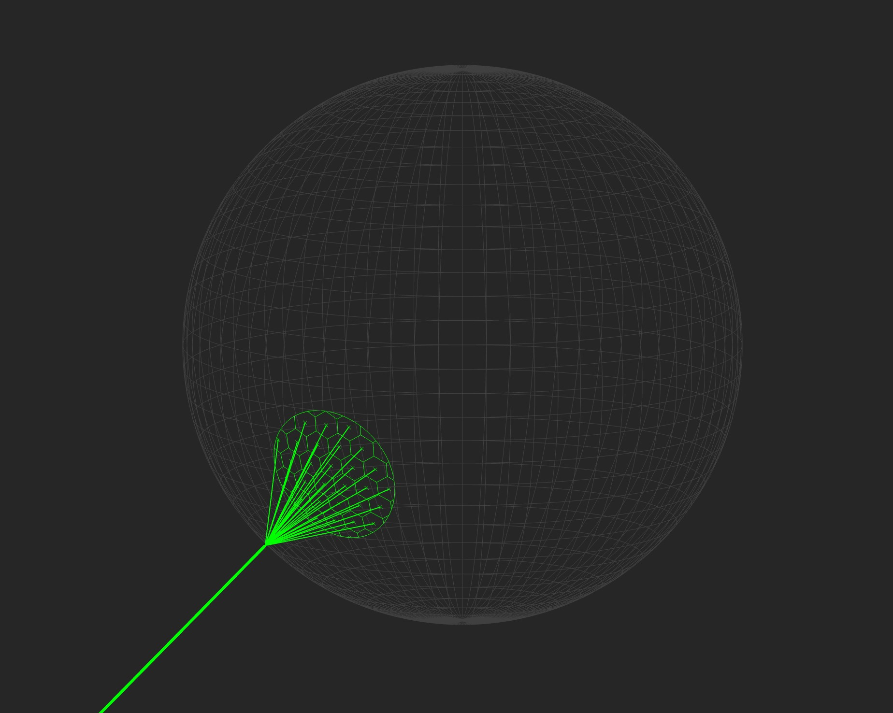

# fast primitive shapes (+fps)

Think of this library as a way to vectorize your MATLAB plots.  It allows you to create the data for multiple shapes simultaneously in a form that exploits the "NaN trick"--a quirk of MATLAB's rendering pipeline that treats NaNs as line breaks in the plot.  This effectively allows you to draw many shapes at once using a single line object, which makes the GPU rendering of your plots significantly faster (see [benchmark](#benchmark) section).

These functions can be used for general plotting, but they really shine in cases where plots need to show a ton of data and/or where the plot is interactive in an app.

This library requires `R2020b` or higher for full functionality.

## Supported Primitives

* [circle](+fps/circle.m)
* [connect](+fps/connect.m) *(connect sets of points in 2d or 3d)*
* [cross](+fps/cross.m)
* [diamond](+fps/diamond.m)
* [ellipse](+fps/ellipse.m)
* [grid](+fps/grid.m)
* [hexagon](+fps/hexagon.m)
* [honeycomb](+fps/honeycomb.m)
* [line](+fps/line.m)
* [mesh](+fps/mesh.m) *(convert `faces` & `vertices` to data that can be plotted as a `line`)*
* [rectangle](+fps/rectangle.m)
* [regular_polygon](+fps/regular_polygon.m) *(any n-sided polygon)*
* [square](+fps/square.m)
* [star](+fps/star.m) *(stars with any number of spikes)*
* [vector](+fps/vector.m) *(lines from point & ray vectors)*

### Optional Arguments

Most functions support at least one of the two optional arguments:
* `N` (=2)
    * The number of datapoints used to draw each line segment.
    * You can increase this parameter to draw shapes with arbitrarily high-resolution.
    * Often useful if the data will undergo a transform prior to plotting.
* `Rotation` (=0)
    * The rotation, in degrees, for each shape.
    * Positive rotations are clockwise about the center of each shape.
    * Can be a scalar (applied to all shapes) or a vector (applied separately to each shape)

## Getting Started

The functions in this library do not plot directly.  Instead, they return arrays of data ready to be passed directly to plotting functions such as `plot` and `line`.  This allows you to choose whether each discrete shape will have its own handle (slow, but supports multiple colors, separate legend entries, etc), or if all the shapes will be plotted as one merged object (much faster).

Let's start by plotting a 2d grid of circles:

```matlab
radius = 0.5;
[x, y] = meshgrid(1:10);
[xdata, ydata] = fps.circle(x(:), y(:), radius);
```
<<<<<<< HEAD
=======
Let's take a look at what we get: 


>>>>>>> 760f4cdc5f4f4adbc6a61559fa462e4786be9fd7

If you pass the 2D `xdata` and `ydata` arrays to `plot` as-is, you'll get a separate handle for each circle.  This is similar to calling `plot` in a for-loop:
```matlab
figure;
plot(xdata, ydata);
legend; axis tight;
```


To accelerate your plotting performance, plot them as one object by flushing the 2D `xdata` and `ydata` arrays to column vectors with the `colon` operator.  This interleaves NaNs in your data, which act as line breaks:
```matlab
figure;
plot(xdata(:), ydata(:)); % note the "(:)" -- this reshapes the 2D matrix to column vector
legend; axis tight;
```


The outputs of any function in `+fps` can be reshaped to a vector and concatenated with any other to merge plotted objects under a single handle.  We'll illustrate by adding a star with a random rotation inside each of the circles--still plotted as a single object.

```matlab
radius = 0.5;
[x, y] = meshgrid(1:10);
[xd_circle, yd_circle] = fps.circle(x(:), y(:), radius);
[xd_star, yd_star] = fps.star(x(:), y(:), radius, radius/3, 5, 'Rotation', randi(360, [numel(x), 1]));

xd = vertcat(xd_circle(:), xd_star(:));
yd = vertcat(yd_circle(:), yd_star(:));

figure;
plot(xd, yd); % already column vectors
legend; axis tight;
```


## Advanced Example: [Death Star](./test/fps_deathstar_example.m)

This is a somewhat complex scene included to get a feel for what you can do with these functions in practice.  The demo uses the `+fps` library to draw the entire scene using only 4 line objects in total (and it could be reduced to 3 with a little more effort).



## Benchmark

Running the included script [fps_benchmark.m](./test/fps_benchmark.m), we can see why keeping the number of handles plotted to a minimum is important for performance.  Note I ran this with 15 trials and took the median, but the included script has `n_trials`=1.


